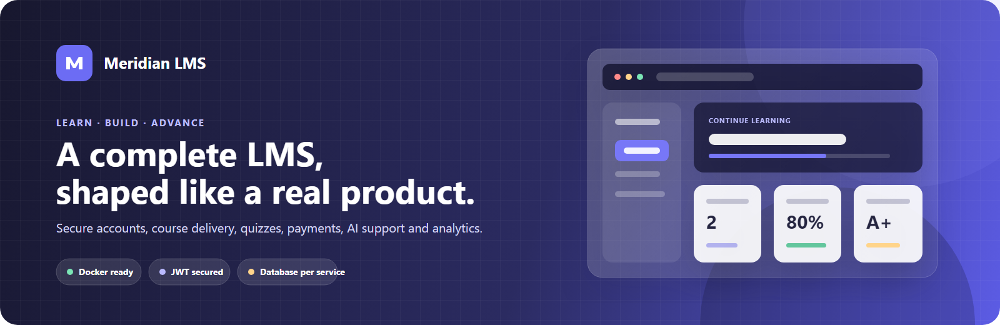
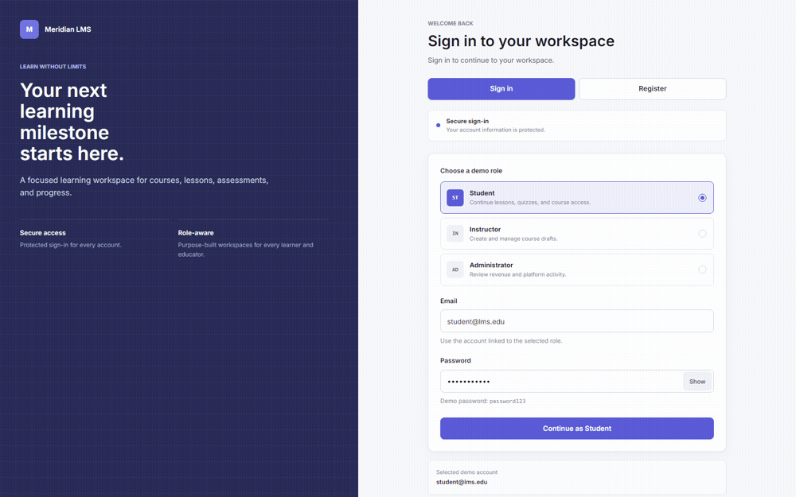
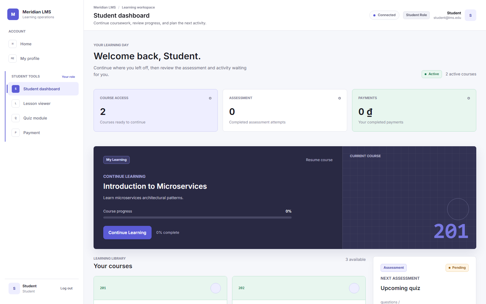
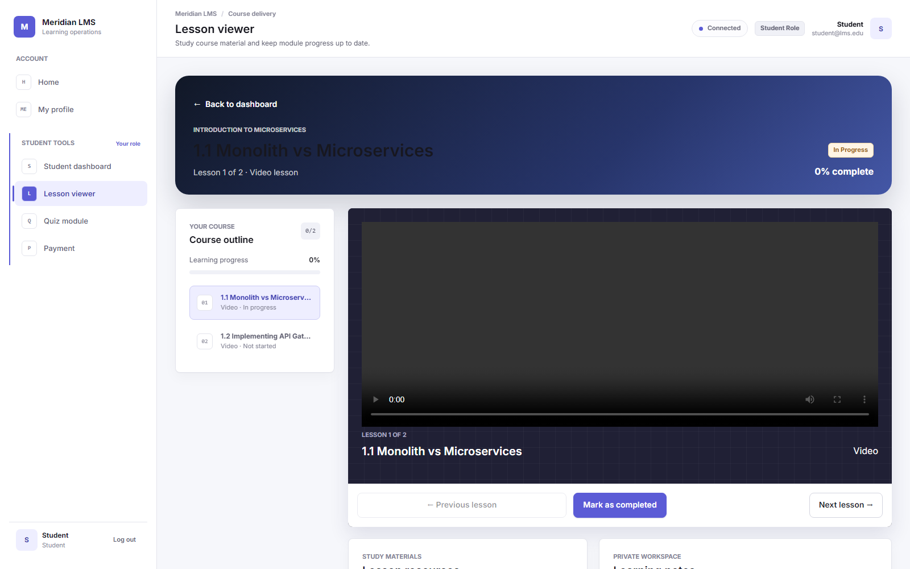
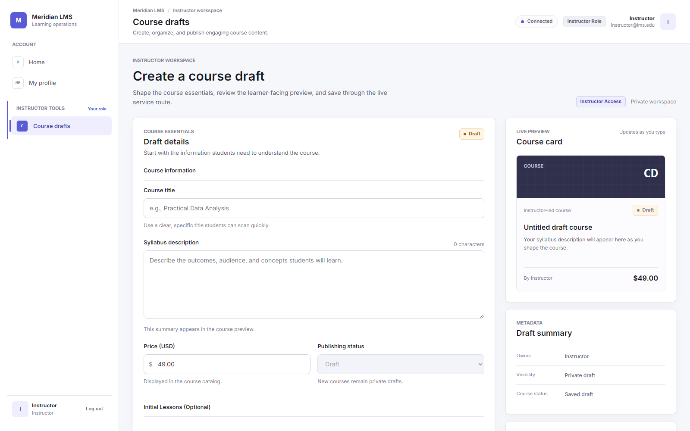
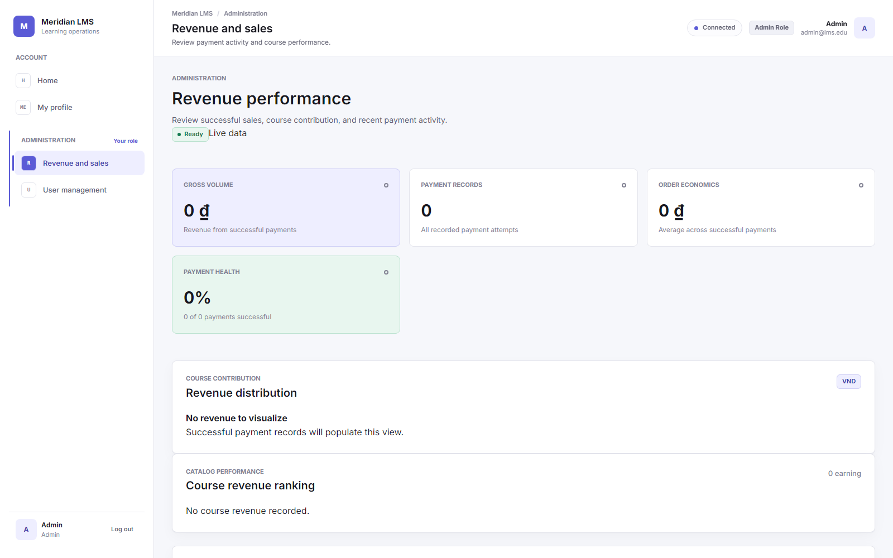
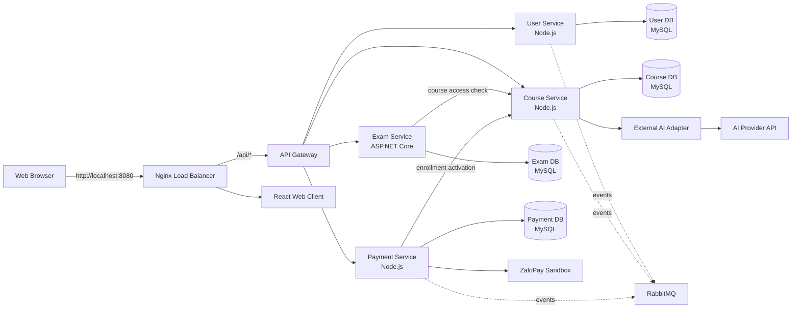

<p align="center">
  <a href="docs/assets/readme/hero.svg" title="Open the scalable Meridian LMS banner">
    
  </a>
</p>

<h1 align="center">Meridian LMS</h1>

<p align="center">
  A production-shaped Learning Management System with secure role-based journeys,<br />
  database-per-service boundaries, real MySQL persistence, and a one-command Docker runtime.
</p>

<p align="center">
  
  
  
  
  
  
</p>

<p align="center">
  <a href="#-quick-start">Quick start</a> ·
  <a href="#-product-tour">Product tour</a> ·
  <a href="#-architecture">Architecture</a> ·
  <a href="#-security">Security</a> ·
  <a href="#-verification">Verification</a> ·
  <a href="docs/README.md">Documentation</a>
</p>

> [!NOTE]
> **Meridian LMS** is a local Docker deployment and portfolio-grade microservices implementation. Core user, course, lesson, quiz, and revenue journeys are backed by real services and MySQL databases. Live ZaloPay Sandbox and AI calls require credentials supplied outside Git.

## ✨ Why Meridian

- **A real product UI** — separate, role-aware workspaces for students, instructors, and administrators.
- **End-to-end learning** — discover courses, unlock content, complete lessons, take quizzes, and keep persisted progress.
- **Secure by default** — bcrypt passwords, signed JWTs, role enforcement, generic login errors, rate limits, and fail-closed secret validation.
- **Backend-authoritative decisions** — identity, payment amount, enrollment, grading, and progress are never trusted from browser state.
- **Clear service ownership** — each core service owns exactly one MySQL database; cross-domain access goes through authenticated HTTP APIs.
- **One-click demo** — Docker Compose brings up the complete stack behind Nginx at `http://localhost:8080`.

## 🎬 Product tour

<p align="center">
  <a href="docs/assets/readme/product-tour.mp4" title="Open the MP4 product tour">
    
  </a>
</p>

<p align="center">
  <sub>Click the animation to open the lightweight MP4 tour.</sub>
</p>

<table>
  <tr>
    <td width="50%" align="center">
      
      <br /><strong>Student workspace</strong><br />
      <sub>Courses, progress, assessments, and payment status.</sub>
    </td>
    <td width="50%" align="center">
      
      <br /><strong>Lesson viewer</strong><br />
      <sub>Course outline, media, resources, progress, notes, and lesson AI.</sub>
    </td>
  </tr>
  <tr>
    <td width="50%" align="center">
      
      <br /><strong>Instructor workspace</strong><br />
      <sub>Draft courses, lessons, quizzes, previews, and publishing.</sub>
    </td>
    <td width="50%" align="center">
      
      <br /><strong>Administration</strong><br />
      <sub>User management and backend-driven revenue reporting.</sub>
    </td>
  </tr>
</table>

## 👥 Role experiences

| Student | Instructor | Administrator |
|---|---|---|
| Register and sign in securely | Create and edit owned course drafts | List and activate/deactivate users |
| Browse published courses | Add, edit, and remove lessons | Review successful payment revenue |
| Continue enrolled courses | Create and manage single-choice quizzes | Inspect course contribution and ledger |
| View video, document, and text lessons | Publish ready courses and quizzes | Access admin-only protected routes |
| Persist lesson completion and progress | Work only within owned drafts | Receive data aggregated across service APIs |
| Take server-graded quizzes and view results | Keep answer keys inside Exam Service | Never query service databases from the UI |
| Start ZaloPay Sandbox checkout | — | — |
| Ask AI using protected lesson context | — | — |

## 🧭 Core journeys

### Learn and track progress

1. The student opens an enrolled, published course.
2. Course Service verifies the JWT and active enrollment.
3. Lesson content and the course outline are loaded from Course DB.
4. Completion is inserted idempotently into `lesson_progress`.
5. Enrollment progress is recalculated and survives refresh.

### Take a quiz

1. The browser loads a published quiz through Nginx and API Gateway.
2. Exam Service asks Course Service to verify published-course access.
3. Student payloads never receive correct-answer fields.
4. Exam Service grades against Exam DB and persists the result server-side.

### Pay for a course

1. Payment Service derives the student from JWT and trusted price from Course Service.
2. A pending Payment DB transaction is created.
3. The service signs ZaloPay Sandbox create/query requests.
4. Only verified provider success can trigger the internal enrollment activation API.

### Ask AI about a lesson

1. Course Service verifies the student and active enrollment.
2. It builds context from the owned Course DB lesson and progress data.
3. The external AI adapter calls the configured provider with a server-side API key.
4. Missing configuration returns a safe error — never a canned answer.

## 🏗 Architecture



### Ownership rules

| Component | Owns | May call | Must not do |
|---|---|---|---|
| User Service | Accounts, login audit, User DB | RabbitMQ | Read another service database |
| Course Service | Courses, lessons, enrollments, progress, Course DB | External AI adapter | Read Payment or Exam DB |
| Exam Service | Quizzes, questions, results, Exam DB | Course Service access API | Read Course DB directly |
| Payment Service | Transactions, provider state, Payment DB | Course Service and ZaloPay | Write Course DB directly |
| API Gateway | Authentication edge and routing | Core services | Grade, aggregate, or access a database |

The complete deployment mapping is documented in [Docker Deployment](docs/deployment/DOCKER_DEPLOYMENT.md).

## 🚀 Quick start

### Windows — one click

1. Install and open **Docker Desktop**.
2. Double-click [`start-lms.bat`](start-lms.bat).
3. Wait for the health checks.
4. Open **http://localhost:8080**.

The launcher builds the images, starts the complete Compose stack, waits for important containers, verifies the public health endpoint, and opens the browser. It does not delete volumes or run services locally.

### Any platform — Docker Compose

```bash
git clone https://github.com/tranhoainam298/lms-microservices-architecture.git
cd lms-microservices-architecture
docker compose up -d --build
docker compose ps
```

Verify the public entry point:

```bash
curl http://localhost:8080/health
```

Expected response:

```json
{"status":"ok","component":"nginx-load-balancer"}
```

Stop containers while preserving database volumes:

```bash
docker compose down
```

> [!WARNING]
> Do not run `docker compose down -v` if you want to preserve local LMS data.

## ⚙️ Configuration

The stack starts with non-secret local defaults. Copy [`.env.example`](.env.example) to `.env` when provider configuration is needed. Never commit the real `.env` file.

| Capability | Environment variables |
|---|---|
| Shared authentication | `JWT_SECRET` |
| Internal service authorization | `INTERNAL_SERVICE_SECRET` |
| ZaloPay Sandbox | `ZALOPAY_APP_ID`, `ZALOPAY_KEY1`, `ZALOPAY_KEY2` |
| Real AI provider | `AI_API_KEY`, `AI_MODEL`, `AI_BASE_URL` |

Behavior without live credentials is explicit:

- Payment source flow remains available, but live provider create/query cannot pass without ZaloPay Sandbox credentials.
- AI endpoints return `AI_PROVIDER_NOT_CONFIGURED`; they do not fabricate an answer.
- No provider key is shipped to the browser, Gateway, or committed source.

## 🔌 Public API

Browser requests use the relative `/api` base and always pass through Nginx and API Gateway.

| Domain | Selected routes |
|---|---|
| Auth | `POST /api/auth/register`, `POST /api/auth/login` |
| Account | `GET /api/users/me`, `PATCH /api/users/me`, `PATCH /api/users/me/password` |
| Courses | `GET /api/courses`, `GET /api/courses/enrolled`, `POST /api/courses/draft` |
| Learning | `GET /api/courses/:courseId/learning`, `POST /api/courses/lessons/:lessonId/complete` |
| AI support | `POST /api/courses/lessons/:lessonId/ai/ask` |
| Exams | `GET /api/exams/quizzes/:quizId`, `POST /api/exams/quizzes/:quizId/submit` |
| Payments | `POST /api/payments/checkout`, `GET /api/payments/check-status/:appTransId` |
| Reporting | `GET /api/payments/reports/revenue` |

Detailed contracts:

- [Authentication](shared/api-contracts/auth-api.md)
- [Courses and learning](shared/api-contracts/course-api.md)
- [Exams](shared/api-contracts/exam-api.md)
- [Payments](shared/api-contracts/payment-api.md)
- [AI support](shared/api-contracts/ai-support-api.md)
- [Revenue reporting](shared/api-contracts/reporting-api.md)

## 🔐 Security

- Passwords are hashed with bcrypt; submitted passwords and hashes are never returned.
- JWT signature, expiration, user ID, and role are verified at protected boundaries.
- Missing secrets fail closed instead of falling back to hardcoded credentials.
- Public registration always creates `student`; privileged public registration is rejected.
- Login errors are generic and protected with audit logging and rate limiting.
- Protected identity comes from verified JWT claims — never body IDs, query IDs, custom browser headers, or React state.
- SQL inputs use parameterized queries; Exam Service uses EF Core parameterization.
- Quiz answer keys stay in Exam DB and grading remains server-side.
- Payment amount comes from trusted Course Service data; provider callbacks require MAC verification.
- Internal Course endpoints require a timing-safe shared-secret comparison.
- AI provider keys stay inside the external adapter container.

See [Architecture Contract](docs/ai-context/ARCHITECTURE_CONTRACT.md) and [Database Ownership Rules](docs/database/database-ownership-rules.md).

## 🧱 Runtime map

| Runtime | Container port | Host access |
|---|---:|---:|
| Nginx load balancer | 80 | **8080** |
| Web Client | 80 | Through Nginx |
| API Gateway | 3000 | 3000, debug only |
| User Service | 5001 | Internal |
| Course Service | 5002 | Internal |
| Exam Service | 5003 | Internal |
| Payment Service | 5004 | Internal |
| User / Course / Exam / Payment MySQL | 3306 each | 3316 / 3317 / 3308 / 3309 |
| RabbitMQ | 5672 / 15672 | 5672 / 15672 |
| External AI adapter | 5005 | Internal |
| External payment mock | 8080 | Internal |

An optional, non-destructive backup simulation is available through the `backup` Compose profile. See the deployment guide before running it.

## 🗂 Repository layout

```text
.
├── api-gateway/        # Public routing and edge JWT enforcement
├── user-service/       # Accounts, profiles, login audit
├── course-service/     # Courses, lessons, enrollments, progress, AI context
├── exam-service/       # Quizzes, questions, grading, results (.NET 9)
├── payment-service/    # Transactions, ZaloPay integration, revenue aggregation
├── web-client/         # React 18 + Vite product UI
├── external-systems/   # AI and payment provider adapters
├── infra/              # Nginx, MySQL init, backup, Docker support
├── shared/             # API and event contracts
├── docs/               # Architecture, decisions, database, deployment
├── tests/              # Focused security and end-to-end checks
└── docker-compose.yml  # Complete local deployment
```

## 🧪 Verification

Run focused security checks:

```bash
node tests/no-architecture-ui-labels.test.js
node tests/startup-script-safety.test.js
node tests/quiz-hardening.test.js
node tests/ai-provider-integration.test.js
```

Build the application surfaces:

```bash
cd web-client && npm run build
cd ../exam-service && dotnet build --nologo
cd .. && docker compose config -q
```

Run the current-route, non-destructive smoke suite while the stack is up:

```powershell
powershell -NoProfile -ExecutionPolicy Bypass -File tests/e2e-full-test.ps1
```

Regenerate the README screenshots from the running application:

```bash
node scripts/capture-readme-media.mjs
```

The capture script uses Chrome or Edge headless mode, calls the real local application, and adds no npm dependency.

## 📊 Implementation status

| Capability | Status |
|---|---|
| Secure login and account workflow | ✅ Achieved |
| Instructor draft course and lesson authoring | ✅ Achieved |
| Published lesson access and persisted progress | ✅ Achieved |
| Server-graded quiz and result persistence | ✅ Achieved |
| Admin user management and revenue reporting | ✅ Achieved |
| Docker deployment behind Nginx | ✅ Achieved |
| ZaloPay Sandbox source integration | 🟡 Complete; live test requires credentials |
| Real AI provider adapter | 🟡 Complete; live test requires `AI_API_KEY` |

For evidence and remaining limitations, see:

- [Implementation Status](docs/ai-context/IMPLEMENTATION_STATUS.md)
- [Sequence Status](docs/ai-context/SEQUENCE_STATUS.md)
- [Known Gaps](docs/ai-context/KNOWN_GAPS.md)
- [Docker Deployment](docs/deployment/DOCKER_DEPLOYMENT.md)

## 📚 Documentation

| Topic | Document |
|---|---|
| Architecture overview | [docs/architecture/README.md](docs/architecture/README.md) |
| Component relationships | [Component & Connector View](docs/architecture/component-connector-view.md) |
| Deployment | [Docker Deployment](docs/deployment/DOCKER_DEPLOYMENT.md) |
| Architecture decisions | [docs/decisions/README.md](docs/decisions/README.md) |
| Database boundaries | [docs/database/README.md](docs/database/README.md) |
| API contracts | [shared/api-contracts/README.md](shared/api-contracts/README.md) |
| AI working context | [docs/ai-context/AI_CONTEXT_INDEX.md](docs/ai-context/AI_CONTEXT_INDEX.md) |

---

<p align="center">
  <strong>Meridian LMS</strong><br />
  Secure learning journeys, explicit ownership, and a demo that starts with one command.
</p>
