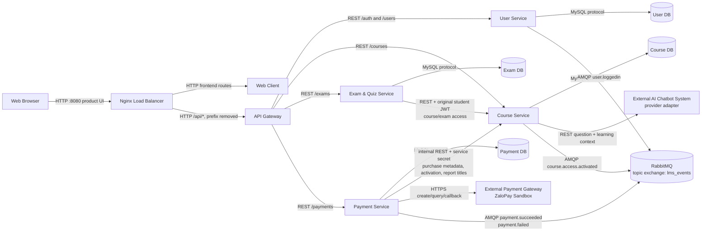

# Component and Connector View

## Runtime topology

## Connector catalog

| From | To | Connector | Actual purpose |
|---|---|---|---|
| Browser | Nginx | HTTP | Public product entry at `http://localhost:8080`; browser API requests use `/api`. |
| Nginx | Web Client | HTTP | Serves/proxies the built React application and client-side fallback. |
| Nginx | API Gateway | HTTP | `/api/*` only; Nginx does not route directly to a business service. |
| API Gateway | User Service | REST | `/auth/*` and `/users/*`. |
| API Gateway | Course Service | REST | `/courses/*`. |
| API Gateway | Exam Service | REST | `/exams/*`. |
| API Gateway | Payment Service | REST | `/payments/*`. |
| Each service | its owned DB | MySQL/TCP | Only its own tables and schema. |
| Exam Service | Course Service | REST with forwarded JWT | `GET /courses/{courseId}/student-exam-access` before student quiz list/load/submit. |
| Payment Service | Course Service | Internal REST | `GET /courses/internal/purchasable/{courseId}`, `POST /courses/internal/enrollments/activate`, and `GET /courses/internal/titles`. |
| Payment Service | ZaloPay Sandbox | HTTPS form API | Creates an order and queries status; callback MAC is verified server-side. |
| Course Service | External AI Chatbot System | REST | `POST /chat` with validated question and Course DB lesson context. |
| User, Payment, Course Services | RabbitMQ | AMQP topic publish | Four versioned, persistent events on `lms_events`. |

## Business consistency across connectors

### Payment and access

After ZaloPay confirms payment, Payment Service conditionally changes the Payment DB row from `pending` to `success` and publishes `payment.succeeded`. It then calls the internally authenticated Course Service activation endpoint. Course Service commits an idempotent enrollment upsert in Course DB and publishes `course.access.activated` only for a newly activated state. If the synchronous activation fails, the payment stays successful and status polling can retry activation; the system does not claim that access was activated.

On a provider failure, Payment Service changes only a pending transaction to `failed`, publishes `payment.failed`, and never calls enrollment activation.

### Message Broker reliability

Publishers use a durable topic exchange, persistent messages, publisher confirms, and reconnection. An event-publication error is logged without secrets and does not corrupt the already committed owning database. Consumers must use `eventId` and business uniqueness rules for idempotency. The present business flow does not consume payment events to perform duplicate enrollment writes.

### AI isolation

Course Service obtains context only from Course DB and sends a minimal learning payload to the external AI adapter. The adapter alone receives `AI_API_KEY`. Missing credentials produce a configuration error rather than a canned answer. Neither Web Client nor API Gateway calls the provider directly.

## Prohibited connectors

There are no runtime connectors for Payment Service -> Course DB, Course Service -> Payment DB, Exam Service -> Course DB, Course Service -> Exam DB, or API Gateway -> any application DB. No shared application database exists.
