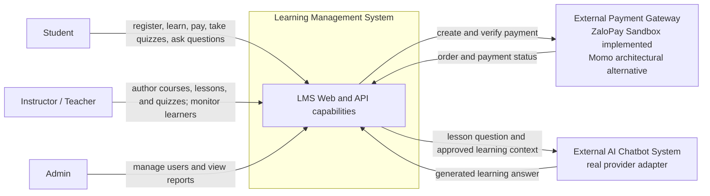

# Context Diagram

## System context

The LMS is one system boundary. Student, Instructor/Teacher, and Admin are its human actors. ZaloPay/Momo and the AI Chatbot System are external systems. Databases and RabbitMQ are internal implementation details and therefore are intentionally not modeled as external actors in this view.

## Actor goals

| Actor | Goals supported by the LMS boundary |
|---|---|
| Student | Manage an account, browse published courses, purchase access, consume lessons/resources, persist progress, take quizzes, view own results, and ask AI questions for an unlocked lesson. |
| Instructor / Teacher | Create and publish owned course drafts, manage lessons/resources and quizzes/questions, and inspect owned-course learning outcomes where implemented. |
| Admin | Manage user accounts and roles, inspect activity, and view revenue reporting. |

## External-system contracts

### Payment Gateway

Payment Service is the only LMS component that communicates with the gateway. The current executable path uses ZaloPay Sandbox create/query/callback operations. Amount, owner, and final payment state are determined server-side. A confirmed provider result is required before Course Service activates access. Momo is not claimed as a live implementation.

### AI Chatbot System

Course Service is the only LMS component that calls the AI Chatbot System. It first validates the student JWT and enrollment and then loads course, lesson, resource, and progress context from Course DB. The browser and API Gateway never receive the provider API key and never call the provider directly.

## Trust boundaries

- Browser input is untrusted. User identity comes from a verified JWT, quiz score is calculated by Exam Service, course price comes from Course Service, and payment status comes from the provider.
- Internal Course Service endpoints used by Payment Service require `INTERNAL_SERVICE_SECRET` and are not public enrollment shortcuts.
- Provider credentials remain server-side and are not part of API responses or events.
- RabbitMQ events contain safe identifiers and state metadata only; they exclude passwords, password hashes, JWTs, provider keys, and database credentials.
