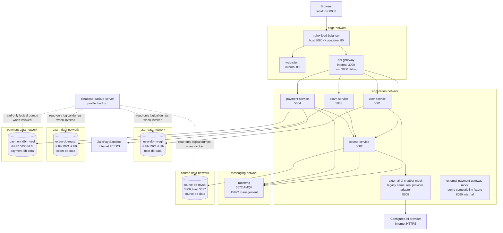

# Deployment View

## Implemented environment

The implemented deployment is a local Docker Compose simulation named `infra`. The normal command is `docker compose up -d --build`, and the public product URL is `http://localhost:8080`. This is not a claim of Kubernetes, AWS, S3, CloudFront, or production high availability.



## Container and port map

| Compose service / container | Internal port | Published host port | Networks | Role |
|---|---:|---:|---|---|
| `nginx-load-balancer` | 80 | `${PUBLIC_HTTP_PORT:-8080}` | `edge-network` | Only normal public entry. |
| `web-client` | 80 | none | `edge-network` | Built React UI; API base `/api`. |
| `api-gateway` | 3000 | `${GATEWAY_PUBLIC_PORT:-3000}` | `edge-network`, `application-network` | Route proxy; host port is debug-only. |
| `user-service` | 5001 | none | `application-network`, `user-data-network`, `messaging-network` | User capability owner. |
| `course-service` | 5002 | none | `application-network`, `course-data-network`, `messaging-network` | Course capability owner. |
| `exam-service` | 5003 | none | `application-network`, `exam-data-network` | Exam capability owner; calls Course over HTTP. |
| `payment-service` | 5004 | none | `application-network`, `payment-data-network`, `messaging-network` | Payment capability owner; calls Course and ZaloPay. |
| `external-ai-chatbot-mock` | 5005 | none | `application-network` | Legacy Compose name for the real provider adapter; no canned fallback. |
| `external-payment-gateway-mock` | 8080 | none | `application-network` | Local compatibility/demo fixture, not the main ZaloPay flow. |
| `rabbitmq` / `lms-rabbitmq` | 5672, 15672 | `${RABBITMQ_PORT:-5672}`, `${RABBITMQ_MANAGEMENT_PORT:-15672}` | `messaging-network`, `host-access-network` | AMQP exchange and local management UI. |
| `user-db-mysql` | 3306 | `${USER_DB_HOST_PORT:-3316}` | `user-data-network`, `host-access-network` | User DB only. |
| `course-db-mysql` | 3306 | `${COURSE_DB_HOST_PORT:-3317}` | `course-data-network`, `host-access-network` | Course DB only. |
| `exam-db-mysql` | 3306 | `${EXAM_DB_HOST_PORT:-3308}` | `exam-data-network`, `host-access-network` | Exam DB only. |
| `payment-db-mysql` | 3306 | `${PAYMENT_DB_HOST_PORT:-3309}` | `payment-data-network`, `host-access-network` | Payment DB only. |
| `database-backup-server` | n/a | none | all four data networks | Disabled-by-default logical backup job under profile `backup`. |

## Network isolation

- `edge-network` connects only public routing components.
- `application-network` enables Gateway-to-service and approved service-to-service HTTP.
- `messaging-network` is internal and connects RabbitMQ only to event-publishing services.
- Each `*-data-network` is internal and connects one business service, its owned MySQL container, and the optional backup job.
- `host-access-network` permits local administrative/debug access to databases and RabbitMQ; it is not a business cross-service path.

The Compose network graph does not give one business service a route to another service's database network.

## Persistence and backup

Named volumes `user-db-data`, `course-db-data`, `exam-db-data`, and `payment-db-data` preserve each schema independently. `rabbitmq-data` preserves broker state. The optional command:

```text
docker compose --profile backup run --rm database-backup-server
```

creates timestamped, single-transaction SQL dumps in `db-backup-data`. It does not delete, overwrite, import, truncate, or reset application data and does not run in the default profile.

## Health and startup

All normal containers define health checks or dependency conditions. Nginx exposes `GET /health`, expected to return HTTP 200 after the stack is ready. `start-lms.bat` performs the Docker Compose start, waits, verifies `http://localhost:8080/health`, and opens the browser at port 8080.

## Credential-dependent connectors

- ZaloPay create/query uses sandbox URLs and requires non-placeholder `ZALOPAY_APP_ID`, `ZALOPAY_KEY1`, and `ZALOPAY_KEY2` for live verification.
- The AI adapter container starts without `AI_API_KEY`, reports degraded configuration, and returns HTTP 503 from `/chat`; it never fabricates an answer.

These missing external credentials do not change the local topology, but source integration must be reported separately from live verification.
