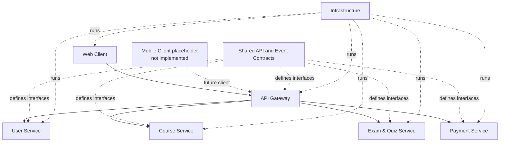

# Module View

## Decomposition principles

This view describes modules that exist in the active source tree. It does not treat placeholder directories as implemented behavior and does not introduce an Analytics, Reporting, Enrollment, Notification, or AI core service.

## Web Client

Active source root: `web-client/src`.

| Module | Existing location | Responsibility |
|---|---|---|
| Application composition | `App.jsx`, `main.jsx` | Authenticated role shell and product-page selection. |
| Product pages | `pages/` | Login, student dashboard, lessons, quiz, payment, instructor authoring, admin users/revenue, and profile. |
| Reusable UI | `components/` | Shell, sidebar/header, course cards, progress and status components. |
| API URL configuration | `config/api.js` | Builds the relative `/api` browser path; does not target services directly. |
| Styling | `styles/global.css` | Shared product presentation. |

The active UI does not expose a standalone architecture page or standalone AI page. AI support is embedded in the enrolled lesson flow.

## API Gateway

Active source root: `api-gateway/src`.

| Module | Existing location | Responsibility |
|---|---|---|
| Composition | `server.js` | Express setup and mounting `/auth`, `/users`, `/courses`, `/exams`, `/payments`. |
| Edge routes | `routes/` | Route validation, JWT/role guards, and delegation. |
| Service proxies | `proxy/` | HTTP forwarding to the four owning services while preserving authorization and downstream status/body. |
| Middleware | `middleware/` | JWT verification, rate limiting, and safe error responses. |

The Gateway contains no SQL client or application-database module.

## User Service

Active source root: `user-service/src`.

| Module | Existing location | Responsibility |
|---|---|---|
| HTTP interface | `routes/`, `controllers/` | Authentication, profile, password, user administration, and activity endpoints. |
| Application logic | `services/authService.js`, `services/userService.js` | Credential validation, JWT creation, profile and admin rules. |
| Persistence | `data/` | User DB pool, bootstrap/migrations, and login-audit repository. |
| Security | `middleware/` | JWT and role enforcement. |
| Events | `events/publisher.js` | Confirmed persistent publication of `UserLoggedInEvent` to `lms_events`. |

## Course Service

Active source root: `course-service/src`.

| Module | Existing location | Responsibility |
|---|---|---|
| HTTP interface | `routes/courseRoutes.js`, `controllers/courseController.js` | Public catalog, instructor authoring, student learning, internal payment/report operations, exam access, and lesson AI. |
| Application logic | `services/courseService.js` | Ownership, publication, enrollment/access, lesson progress, AI-context, and internal metadata rules. |
| Persistence | `data/database.js`, `data/initDb.js`, `data/migrateLessonProgress.js`, `data/migrateEnrollmentUniqueness.js` | Course DB access and additive schema compatibility. |
| Events | `data/courseEventPublisher.js` | Persistent `CourseAccessActivatedEvent` publication after a newly committed activation. |
| Security | `middleware/` and route-local internal auth | JWT/role enforcement and internal shared-secret verification. |

`rabbitmq-listener.js` is a compatibility no-op. Enrollment is intentionally not event-consumed; the authenticated synchronous activation endpoint is authoritative and idempotent.

## Exam & Quiz Service

Active source roots: `exam-service/Controllers`, `Data`, `Models`, and `DTOs`.

| Module | Existing location | Responsibility |
|---|---|---|
| Host and security pipeline | `Program.cs` | ASP.NET Core hosting, JWT verification, EF Core, Course Service `HttpClient`, and schema initialization. |
| Quiz API/application logic | `Controllers/QuizController.cs` | Instructor quiz CRUD/publish, student retrieval, access check, grading, duplicate policy, and own-result access. |
| Persistence | `Data/ExamDbContext.cs`, `Data/ExamSchemaMigrator.cs` | Exam DB mapping and additive compatibility. |
| Domain records | `Models/` and `DTOs/` | Quizzes, questions, results, authoring input, and submissions. |

Correct options remain in Exam DB and instructor management responses; student quiz retrieval omits them. Student identity and score are produced server-side.

## Payment Service

Active source roots: `payment-service/index.js` and `payment-service/src/events`.

| Module | Existing location | Responsibility |
|---|---|---|
| HTTP/application orchestration | `index.js` | Student/admin JWT checks, checkout, ZaloPay create/query/callback, Payment DB transitions, Course Service calls, and revenue aggregation. |
| Event publishing | `src/events/publisher.js` | Confirmed persistent publication of `PaymentSucceededEvent` and `PaymentFailedEvent`. |

The current implementation is intentionally compact rather than split into invented layers. Its SQL pool points only to Payment DB; all course data comes through Course Service HTTP APIs.

## Shared contracts

- `shared/api-contracts/` specifies actual public and internal HTTP behavior.
- `shared/event-contracts/` specifies the `lms_events` envelope, routing keys, payload restrictions, and idempotency semantics.

These are documentation contracts, not a shared database or shared business-logic service.

## Infrastructure

| Module | Existing location | Responsibility |
|---|---|---|
| Composition | `docker-compose.yml` | Containers, health checks, environment wiring, networks, and volumes. |
| Edge routing | `infra/nginx/load-balancer.conf` | Public frontend and `/api` routing to Gateway only. |
| Fresh database bootstrap | `infra/mysql-init/` | One initialization script per owned MySQL database. |
| Backup simulation | `infra/backup/` | Optional, non-destructive SQL dumps under the `backup` profile. |
| Local launch and repair | `start-lms.bat`, `repair-db-users*.bat`, `scripts/` | Safe Windows operation without volume deletion. |

Reporting and analytics are capabilities inside existing owners: Payment Service for revenue, Course Service for learning progress, Exam Service for results, and User Service for login activity.
