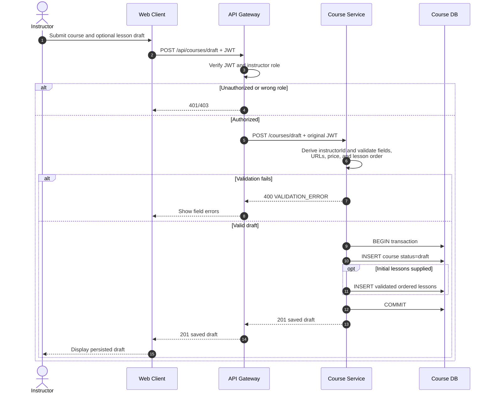
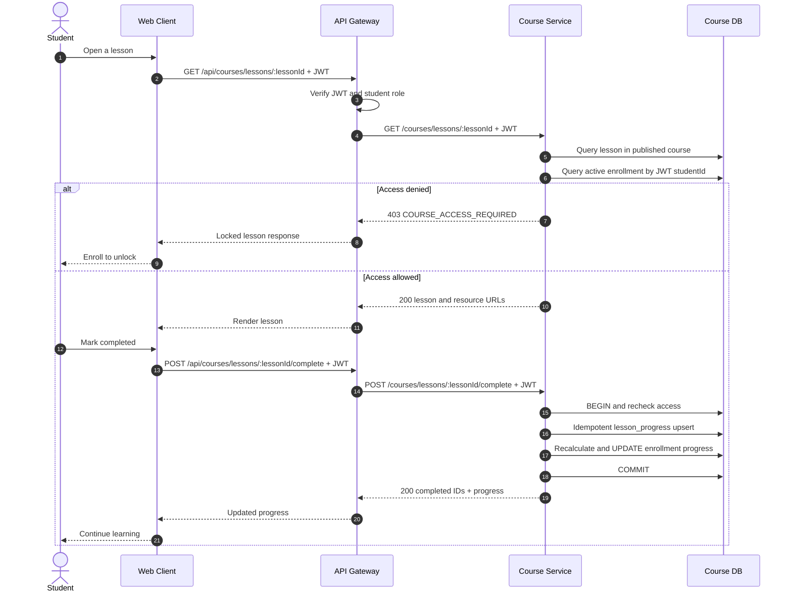
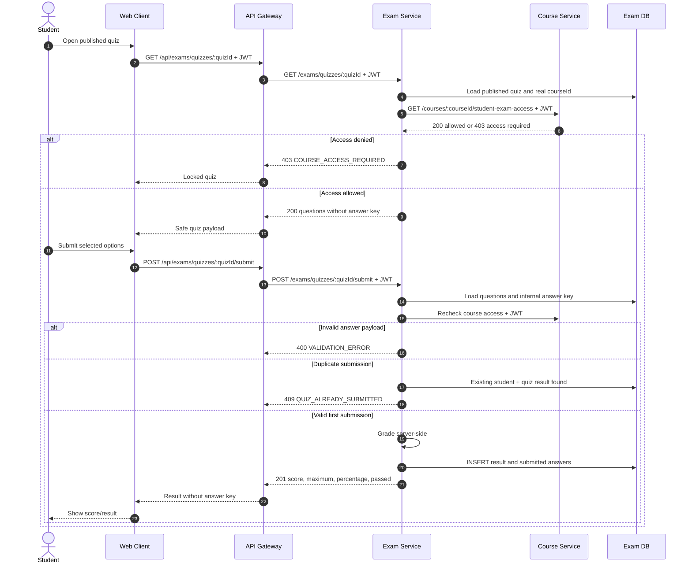
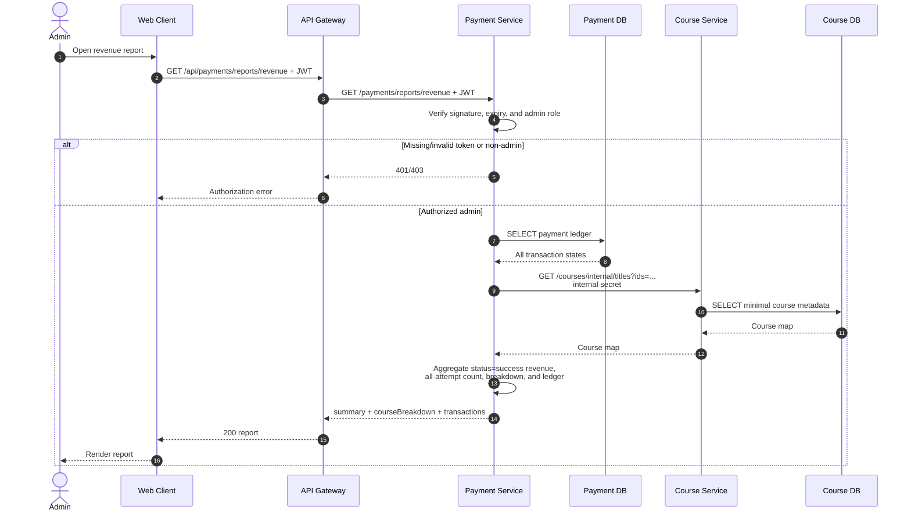
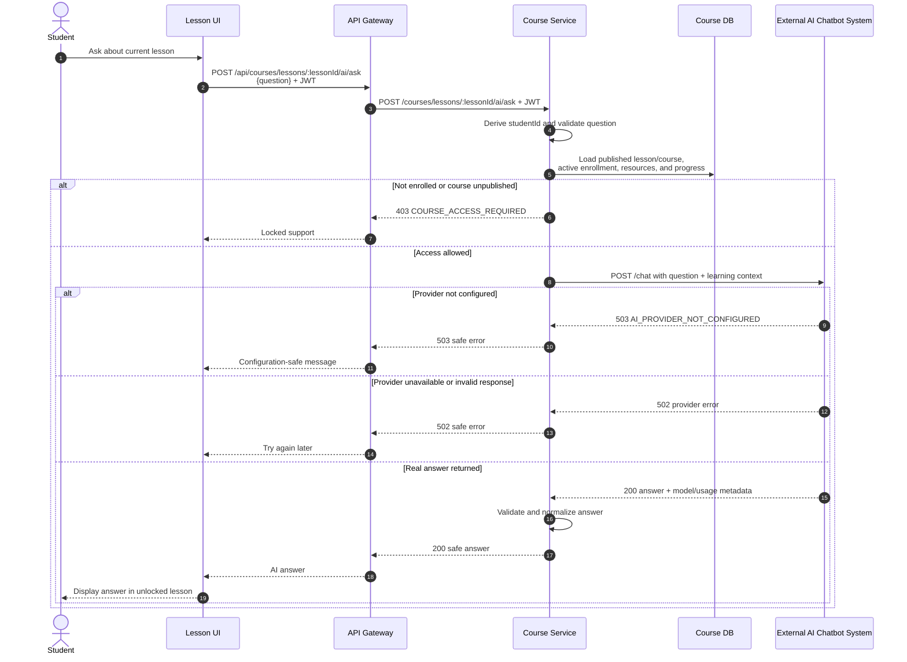

# Sequence Diagrams

## Conventions

- Browser URLs use `/api`. Nginx removes that prefix before API Gateway receives the request.
- API Gateway forwards the original Authorization header and preserves downstream status/body.
- Identity is derived from a verified JWT; browser-supplied identity fields are not authoritative.
- Each service accesses only its owned database.
- Internal Payment-to-Course calls use `X-Internal-Service-Secret`.
- RabbitMQ events use the durable topic exchange `lms_events` and the versioned envelope defined in `shared/event-contracts/`.

The canonical standalone sources are in [`docs/diagrams/sequence/`](../diagrams/sequence/).

## 1. Login with Message Broker

Actual endpoint: `POST /api/auth/login` (Gateway/User Service path: `POST /auth/login`).
Standalone source: [01-login.md](../diagrams/sequence/01-login.md).

```mermaid
sequenceDiagram
    autonumber
    actor User
    participant Web as Web Client
    participant Gateway as API Gateway
    participant UserSvc as User Service
    participant UserDB as User DB
    participant Broker as Message Broker

    User->>Web: Submit email, password, selected role
    Web->>Gateway: POST /api/auth/login
    Gateway->>Gateway: Rate-limit and validate request
    Gateway->>UserSvc: POST /auth/login
    UserSvc->>UserDB: SELECT user by normalized email
    UserDB-->>UserSvc: Credential and account record
    UserSvc->>UserSvc: Verify password hash, account status, and role
    alt Invalid credentials/status/role
        UserSvc->>UserDB: INSERT failed login_audit
        UserSvc-->>Gateway: 401/403 safe error
        Gateway-->>Web: Authentication error
    else Successful login
        UserSvc->>UserSvc: Create signed JWT
        UserSvc->>UserDB: INSERT successful login_audit
        UserSvc->>Broker: Publish UserLoggedInEvent<br/>user.loggedin
        opt Broker unavailable
            Broker--xUserSvc: Publish confirmation fails
            UserSvc->>UserSvc: Log safe warning; do not fail login
        end
        UserSvc-->>Gateway: 200 accessToken + userProfile
        Gateway-->>Web: Authenticated response
        Web-->>User: Open role workspace
    end
```

`UserLoggedInEvent.data` contains only `userId`, `role`, and `loginTime`; it contains no password, password hash, email credential, or JWT.

## 2. Save Draft Course

Actual endpoint: `POST /api/courses/draft` (Gateway/Course Service path: `POST /courses/draft`).
Standalone source: [02-save-draft-course.md](../diagrams/sequence/02-save-draft-course.md).



The instructor identifier always comes from the JWT. Course Service is the only writer to Course DB.

## 3. View Lesson and Persist Progress

Actual endpoints: `GET /api/courses/:courseId/learning`, `GET /api/courses/lessons/:lessonId`, and `POST /api/courses/lessons/:lessonId/complete`.
Standalone source: [03-view-lesson.md](../diagrams/sequence/03-view-lesson.md).



Repeated completion does not duplicate progress because the student/course/lesson combination is unique.

## 4. Take Quiz

Actual endpoints: `GET /api/exams/quizzes/:quizId` and `POST /api/exams/quizzes/:quizId/submit`. Course access dependency: `GET /courses/:courseId/student-exam-access`.
Standalone source: [04-take-quiz.md](../diagrams/sequence/04-take-quiz.md).



Exam Service owns answer keys, grading, and results. It has no Course DB connection.

## 5. Pay for Course with Message Broker

Actual endpoints: `POST /api/payments/checkout`, `GET /api/payments/check-status/:appTransId`, and `POST /api/payments/callback/zalopay`. Internal Course endpoints: `GET /courses/internal/purchasable/:courseId` and `POST /courses/internal/enrollments/activate`.
Standalone source: [05-pay-for-course.md](../diagrams/sequence/05-pay-for-course.md).

```mermaid
sequenceDiagram
    autonumber
    actor Student
    participant Web as Web Client
    participant Gateway as API Gateway
    participant PaymentSvc as Payment Service
    participant PaymentDB as Payment DB
    participant CourseSvc as Course Service
    participant CourseDB as Course DB
    participant Provider as Payment Gateway
    participant Broker as Message Broker

    Student->>Web: Select paid course
    Web->>Gateway: POST /api/payments/checkout<br/>{courseId, paymentMethod: zalopay} + JWT
    Gateway->>PaymentSvc: POST /payments/checkout + JWT
    PaymentSvc->>PaymentSvc: Derive studentId; reject untrusted method/input
    PaymentSvc->>CourseSvc: GET /courses/internal/purchasable/:courseId<br/>internal secret
    CourseSvc->>CourseDB: SELECT published title and price
    CourseSvc-->>PaymentSvc: Trusted course metadata
    PaymentSvc->>PaymentDB: GET_LOCK for JWT student + course
    PaymentSvc->>PaymentDB: Check existing pending/success payment
    alt Checkout already active or lock busy
        PaymentSvc-->>Gateway: 409 busy/already pending/already completed
        Gateway-->>Web: Reuse/check existing payment state
    else Checkout reserved atomically
        PaymentSvc->>PaymentDB: INSERT one pending backend-priced transaction
        PaymentSvc->>PaymentDB: RELEASE_LOCK
        PaymentSvc->>Provider: POST ZaloPay Sandbox /v2/create + HMAC
        alt Provider explicitly rejects order<br/>(return_code != 1, including 2, or no order_url)
        PaymentSvc->>PaymentDB: Conditional pending -> failed
        PaymentSvc->>Broker: Publish PaymentFailedEvent<br/>payment.failed
        PaymentSvc-->>Gateway: 502 safe failure
        Gateway-->>Web: Checkout failed
        Note over PaymentSvc,CourseDB: No enrollment activation
    else Create response is lost or provider transport unavailable
        PaymentSvc->>PaymentSvc: Preserve pending as recoverable ambiguity
        PaymentSvc-->>Gateway: Safe provider-unavailable error
        Gateway-->>Web: Retry status later
        Note over PaymentSvc,Broker: No payment.failed event without explicit failure
        Note over PaymentSvc,Provider: Signed callback/query may later confirm success
    else Order created
        Provider-->>PaymentSvc: order_url
        PaymentSvc-->>Gateway: 201 pending payment + orderUrl + appTransId
        Gateway-->>Web: Open provider order
        Student->>Provider: Complete or cancel payment
        Web->>Gateway: GET /api/payments/check-status/:appTransId + JWT
        Gateway->>PaymentSvc: GET /payments/check-status/:appTransId + JWT
        PaymentSvc->>PaymentDB: Load owned payment
        PaymentSvc->>Provider: POST ZaloPay Sandbox /v2/query + HMAC
        Note over Provider,PaymentSvc: Valid KEY2 callback is an alternative confirmation path
        alt Provider confirms success
            PaymentSvc->>PaymentDB: Conditional pending -> success
            opt First successful transition
                PaymentSvc->>Broker: Publish PaymentSucceededEvent<br/>payment.succeeded
            end
            PaymentSvc->>CourseSvc: POST /courses/internal/enrollments/activate<br/>internal secret
            CourseSvc->>CourseDB: Idempotent active enrollment transaction
            opt Newly activated
                CourseSvc->>Broker: Publish CourseAccessActivatedEvent<br/>course.access.activated
            end
            CourseSvc-->>PaymentSvc: Active enrollment
            PaymentSvc-->>Gateway: paid + access activated
            Gateway-->>Web: Final status
            Web-->>Student: Refresh access
        else Provider confirms failure (return_code=2)
            PaymentSvc->>PaymentDB: Conditional pending -> failed
            PaymentSvc->>Broker: Publish PaymentFailedEvent<br/>payment.failed
            PaymentSvc-->>Gateway: paid=false, failed
            Gateway-->>Web: Payment failed
            Note over PaymentSvc,CourseDB: No enrollment write
        else Query transport unavailable
            PaymentSvc->>PaymentSvc: Preserve pending; outcome is ambiguous
            PaymentSvc-->>Gateway: Safe provider-unavailable error
            Note over PaymentSvc,Broker: No payment.failed event
        else Still pending
            PaymentSvc-->>Gateway: paid=false, pending
            Gateway-->>Web: Continue bounded polling
        end
        end
    end
```

Synchronous activation is authoritative. Events are asynchronous facts and never cause a second enrollment write. Concurrent checkout requests are serialized by a per-student/course `GET_LOCK`, and the reservation rejects any existing `pending` or `success` payment. Repeated callbacks/polls are safe through conditional payment transitions and idempotent Course Service activation. Only an explicit provider rejection/failure produces `payment.failed`; transport ambiguity remains recoverable `pending` state.

## 6. View Revenue Report

Actual endpoint: `GET /api/payments/reports/revenue`; metadata dependency: `GET /courses/internal/titles?ids=...`.
Standalone source: [06-view-revenue-report.md](../diagrams/sequence/06-view-revenue-report.md).



Payment Service owns aggregation and Payment DB. Course Service supplies metadata through HTTP; neither reads the other's database.

## 7. Ask a Learning Question

Actual endpoint: `POST /api/courses/lessons/:lessonId/ai/ask`; external adapter endpoint: `POST /chat`.
Standalone source: [07-ask-learning-question.md](../diagrams/sequence/07-ask-learning-question.md).



Only the external AI adapter receives `AI_API_KEY`. The learning prompt excludes JWTs, credentials, payment data, internal secrets, and full user profiles. Without a configured key, no fake answer is returned.

## Runtime versus credential-dependent verification

All seven diagrams describe implemented source paths and actual endpoint names. Login/course/exam/revenue paths and RabbitMQ publication can be verified locally. The ZaloPay adapter is restricted to Sandbox but a live order/query requires valid sandbox credentials. The AI adapter contains a real provider call, but a live answer requires `AI_API_KEY`. Missing external credentials must be reported as blocked live verification, not as an implemented mock success and not as a failure of the internal architecture.
