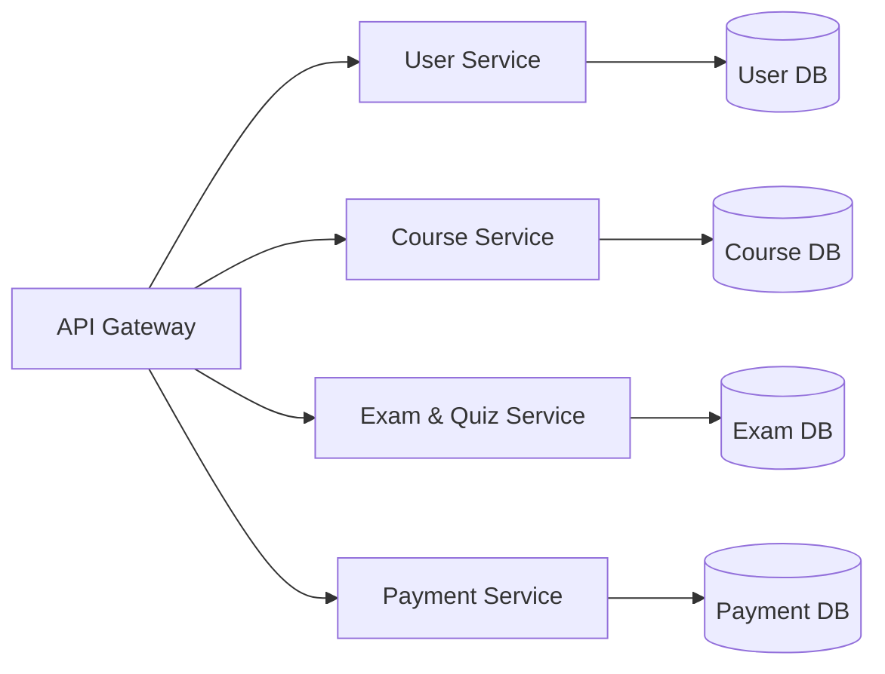

# Database Architecture

The LMS implements database-per-service with four private MySQL databases and no shared application database.

| Database | Owner | Current tables | Primary responsibility |
|---|---|---|---|
| User DB (`lms_user_db`) | User Service | `users`, `login_audit` | Identity, profile, role/status, login audit |
| Course DB (`lms_course_db`) | Course Service | `courses`, `lessons`, `enrollments`, `lesson_progress` | Course authoring, lesson content, access, durable progress |
| Exam DB (`lms_exam_db`) | Exam & Quiz Service | `quizzes`, `questions`, `quiz_results` | Quiz authoring, server-side answer keys/grading, results |
| Payment DB (`lms_payment_db`) | Payment Service | `transactions` | Checkout/provider state and revenue source ledger |

There is no Reporting DB, Chatbot DB, Enrollment DB, Learning Result DB, or shared database.

## Integration rules

1. A service connects only to its own database.
2. Cross-domain decisions use service APIs. Examples include Exam Service asking Course Service for course access, and Payment Service asking Course Service for purchasable metadata and enrollment activation.
3. RabbitMQ events communicate asynchronous facts. The immediate paid-course access path remains the synchronous, internally authenticated Payment Service to Course Service request; events do not perform a duplicate enrollment write.
4. Payment Service aggregates the revenue report from Payment DB and enriches it with minimal Course Service metadata. API Gateway routes the request only.
5. AI context is assembled transiently by Course Service from Course DB and sent to the external AI Chatbot System. No AI context table or AI database exists.

See the per-database documents for exact columns, indexes, and foreign keys, and `database-ownership-rules.md` for enforceable boundaries.
