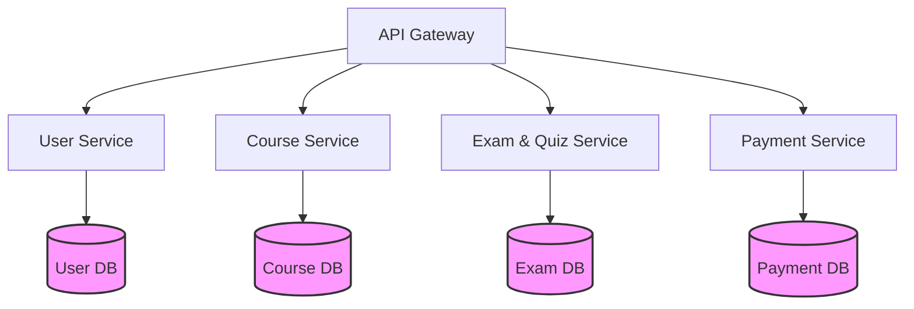

# Database Architecture

This directory contains the database design documentation for the Learning Management System (LMS) Microservices project.

## Database-per-Service Pattern

To ensure loose coupling, independent scalability, and autonomous deployment of each microservice, the system implements the **Database-per-Service** design pattern. 

In this pattern:
- Each service owns its database private data.
- Other services cannot access this database directly.
- The schema of a database is completely private to its owner service.

## Allowed Databases

The architecture permits **exactly 4 databases**. No extra databases (e.g., Reporting DB, Chatbot DB, Learning Result DB, Notification DB, or Enrollment DB) are allowed.

| Database Name | Owner Service | Primary Purpose |
|---|---|---|
| **User DB** | User Service | User accounts, profiles, roles, permissions, login audits |
| **Course DB** | Course Service | Courses, lessons, course access, learning progress, AI context |
| **Exam DB** | Exam & Quiz Service | Question bank, quizzes, attempts, answers, grading |
| **Payment DB** | Payment Service | Payments, transactions, payment gateway logs, revenue records |

## Communication and Integration Rules

Since services are strictly isolated:
1. **No Direct Cross-Database Queries**: A service must never run SQL queries or establish direct connections to a database owned by another service.
2. **API-Based Communication**: Services fetch shared data or trigger actions in other services by making HTTP/REST calls through APIs (managed via API Gateway or internal DNS).
3. **Event-Driven Integration**: For asynchronous or decoupled propagation of state (e.g., student completes a payment, triggering course access activation), services publish events to the **Message Broker**. Interested services subscribe to these events to update their own databases.
