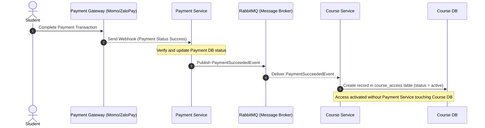

# RabbitMQ Event Flow

This document details the event-driven integration design using RabbitMQ as the message broker. Events decouple microservices by propagating state changes asynchronously without creating direct service dependencies.

---

## Event Registry

The following events are planned for propagation across the microservices ecosystem:

| Event Name | Publisher | Main Consumers | Payload Data Summary | Description |
| :--- | :--- | :--- | :--- | :--- |
| **UserLoggedInEvent** | User Service | None (audit logs) | `userId`, `loginTime`, `ipAddress` | Published upon successful user authentication. |
| **CourseDraftSavedEvent** | Course Service | None | `courseId`, `instructorId`, `timestamp` | Published when a new course draft is successfully created. |
| **PaymentCreatedEvent** | Payment Service | None (audit) | `paymentId`, `studentId`, `courseId`, `amount` | Published when a checkout session is initiated. |
| **PaymentSucceededEvent** | Payment Service | Course Service | `paymentId`, `studentId`, `courseId`, `amount`, `transactionRef` | Published when payment verification succeeds. |
| **PaymentFailedEvent** | Payment Service | None (audit) | `paymentId`, `studentId`, `courseId`, `failureReason` | Published when payment attempt fails or expires. |
| **CourseAccessActivatedEvent** | Course Service | Exam Service | `accessId`, `studentId`, `courseId`, `grantedAt` | Published when a student gets access to a course (enables quiz attempts). |
| **LessonCompletedEvent** | Course Service | Exam Service | `progressId`, `studentId`, `lessonId`, `completedAt` | Published when a student marks a lesson completed. |

---

## Important Workflow: Payment to Course Access Activation

To preserve strict database isolation (the **Database-per-Service** pattern), the Payment Service must never write directly to the Course DB to activate a student's course access. Instead, the flow is completely decoupled using events and APIs:

### Detailed Steps:
1. **Transaction Completion**: The student finishes checkout via the Payment Gateway (Momo or ZaloPay).
2. **Webhook Callback**: The Payment Gateway issues a secure webhook call back to the Payment Service notifying it of success.
3. **Internal Log and Post**: Payment Service updates the transaction state to `completed` in the Payment DB.
4. **Publish Event**: The Payment Service publishes a `PaymentSucceededEvent` to a RabbitMQ exchange (e.g., `payment.exchange`).
5. **Consume Event**: The Course Service, subscribing to a queue bound to `payment.exchange` with routing key `payment.succeeded`, receives the event.
6. **Access Grant**: The Course Service processes the event, creates a new entry in its local `course_access` table within the **Course DB** to grant the student access, and updates the student's status.
