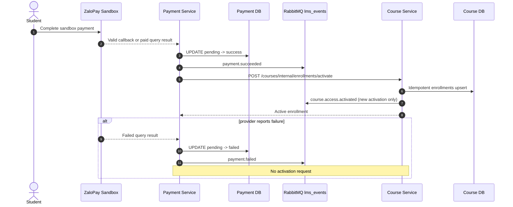

# RabbitMQ Event Flow

The implemented broker is RabbitMQ. User, Payment, and Course services publish persistent messages with publisher confirms to the durable topic exchange `lms_events`. Core database state remains authoritative; a broker failure is logged safely and does not create a cross-database write.

## Versioned event envelope

Every active event contains `eventId`, `eventType`, `eventVersion` (`1`), `occurredAt`, `source`, and `data`. The event ID is the consumer deduplication key. Passwords, password hashes, JWTs, provider keys, callback MACs, database credentials, and internal service secrets are prohibited.

## Active event registry

| Event | Routing key | Producer | Published after | Current business dependency |
| :--- | :--- | :--- | :--- | :--- |
| `UserLoggedInEvent` | `user.loggedin` | User Service | Credentials are verified and a JWT is created | None; login still succeeds when non-critical publication is unavailable. |
| `PaymentSucceededEvent` | `payment.succeeded` | Payment Service | Atomic `pending -> success` transition in Payment DB | None for enrollment; immediate access uses authenticated HTTP. |
| `PaymentFailedEvent` | `payment.failed` | Payment Service | Atomic `pending -> failed` transition in Payment DB | None; Course Service is not called. |
| `CourseAccessActivatedEvent` | `course.access.activated` | Course Service | New or reactivated enrollment commits in Course DB | None; it is an asynchronous notification, not a second write path. |

There is no active `CourseDraftSavedEvent`, `PaymentCreatedEvent`, or `LessonCompletedEvent` contract in the final runtime. Exact schemas are maintained under `shared/event-contracts/`.

## Payment to course access

The synchronous internal Course API is the authoritative immediate-access path. RabbitMQ records the state transitions asynchronously and must never cause a duplicate enrollment write.

Course DB enforces one enrollment per `(student_id, course_id)`. Repeated provider callbacks or status queries do not repeat a Payment DB transition, event publication, or enrollment row. The retired Course listener does not consume payment events to mutate Course DB.

## Delivery behavior

- The exchange is durable and messages are marked persistent.
- Publishers use confirms, a bounded timeout, and one reconnect retry while retaining the same event ID.
- Current core flows do not require an asynchronous consumer to finish a request.
- Runtime verification binds an exclusive, auto-delete test queue to the four routing keys; shared queues are not removed.
